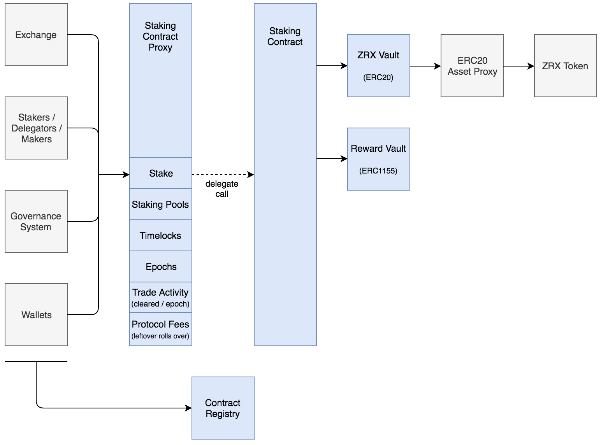
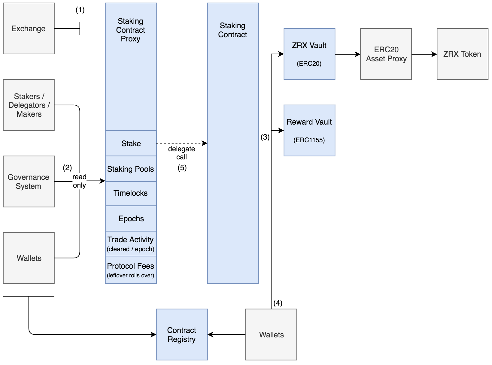

## Staking Contracts

This package implements the stake-based liquidity incentives defined by [ZEIP-31](https://github.com/0xProject/ZEIPs/issues/31).

Functionality:
  1. Stake your ZRX tokens to unlock their utility within the 0x ecosystem.
     - Earn rebates on market making on the 0x protocol
     - Participate in governance over the 0x protocol
  2. Create staking pools to leverage the weight of other stakers.
     - Increase your market making rebates. 
     - Increase your voting power.
  3. Delegate your Zrx to staking pools to 
     - Earn a portion of the pool's market making rebates.
     - Support a pool's mission sharing your voting power.


## Architecture

This system is composed of four deployed contracts:
1. Staking Contract, which is an upgradeable/stateless contract that implements staking logic.
2. Staking Contract Proxy, which stores staking state and delegates to the Staking Contract.
3. Zrx Vault, which securely holds staked Zrx Tokens.
4. Staking Pool Reward Vault, which securely holds rewards earned by staking pools.

These contracts connect to each other and the broader 0x ecosystem like this:



## Architecture (Catastrophic Failure Mode)
If a vulnerability is discovered in the staking contract. 
  1. The 0x Exchange contract stops charging protocol fees
  2. The staking contract is set to read-only mode (clients may still query balances)
  3. Vaults are detached from the staking contract
  4. Users may withdraw their assets directly from vaults
  5. If state is corrupted, the staking storage is detached from the logic contract and a new storage contract is deployed

 Steps 1-3 are triggered immediately upon discovering a potential failure. Steps 4-5 are triggered if the internal staking state has been corrupted; in this worst-case scenario, the staking contract must be re-deployed — users withdraw their funds from the vaults and re-stake under a new staking contract.




## Contracts Directory Structure
The contracts can be found in `contracts/src`.

```
* Staking.sol        | This is a stateless contract that encapsulates all the staking logic.
* StakingProxy.sol   | This is a stateful contract that proxies into the Staking contract.
* fees/              | This contains mixins that implement the logic for 0x Protocol fees & rebates.
* immutable/         | This contains mixins that should not be changed.
* interfaces/        | This contains interfaces used throughout the entire staking system.
* libs/              | This contains libraries used by the staking contract; for example, math and signature validation.
* stake/             | This contains mixins that implement the core staking logic.
* staking_pools/     | This contains mixins that implement logic for creating and managing staking pools.
* sys/               | This contains mixins that implement low-level functionality, like scheduling.
* vaults/            | This contains the vaults (like the Zrx Token Vault).
```

## Testing Architecture

These contracts use an actor/simulation pattern. A simulation runs with a specified set of actors, initial state and expected output. Actors have a specific role and validate each call they make to the staking system; for example, there is a Staking Actor who stakes/unstakes their Zrx tokens and validates balances/events. Similarly, there could exist an actor who tries to steal funds.


## Installation

**Install**

```bash
npm install @0x/contracts-staking --save
```

## Contributing

We strongly recommend that the community help us make improvements and determine the future direction of the protocol. To report bugs within this package, please create an issue in this repository.

For proposals regarding the 0x protocol's smart contract architecture, message format, or additional functionality, go to the [0x Improvement Proposals (ZEIPs)](https://github.com/0xProject/ZEIPs) repository and follow the contribution guidelines provided therein.

Please read our [contribution guidelines](../../CONTRIBUTING.md) before getting started.

### Install Dependencies

If you don't have yarn workspaces enabled (Yarn < v1.0) - enable them:

```bash
yarn config set workspaces-experimental true
```

Then install dependencies

```bash
yarn install
```

### Build

To build this package and all other monorepo packages that it depends on, run the following from the monorepo root directory:

```bash
PKG=@0x/contracts-staking yarn build
```

Or continuously rebuild on change:

```bash
PKG=@0x/contracts-staking yarn watch
```

### Clean

```bash
yarn clean
```

### Lint

```bash
yarn lint
```

### Run Tests

```bash
yarn test
```

#### Testing options

Contracts testing options like coverage, profiling, revert traces or backing node choosing - are described [here](../TESTING.md).
